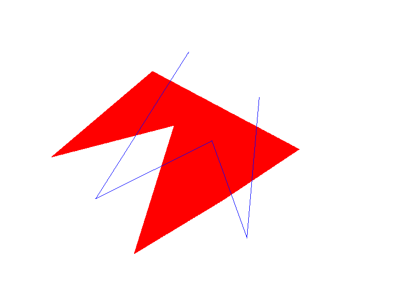

# 画板 Beta

## 原理

采用了以下算法进行绘制：

* 中点画线法
* 有序边表填充算法
* Weiler-Atherton多边形裁剪算法
* 基于齐次坐标的图形移动

## 实现

对应相应的原理：

1. 单击左键画点，绘制直线组成填充区域（中点画线法）
2. 单击右键结束，进行图形填充（有序边表填充算法）
3. 再次点击左键画点，绘制截取区域
4. 单击右键完成截取（Weiler-Atherton多边形裁剪算法）
5. 响应鼠标移动（基于齐次坐标的图形移动）

